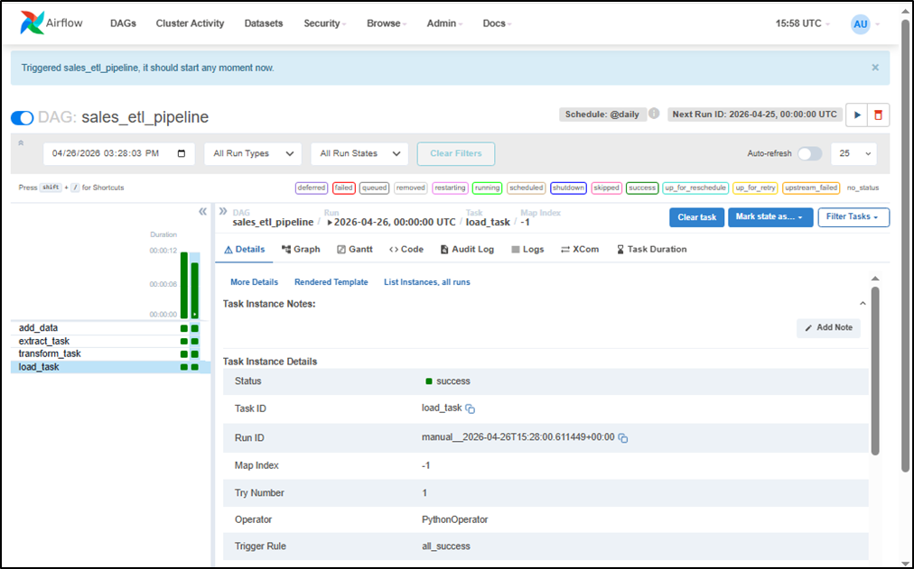
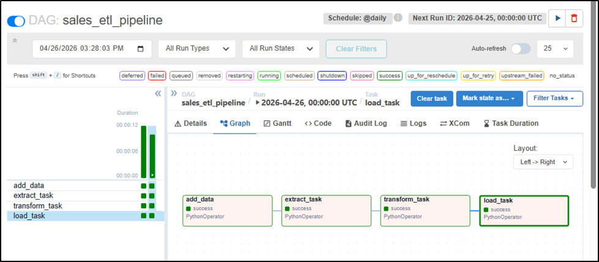
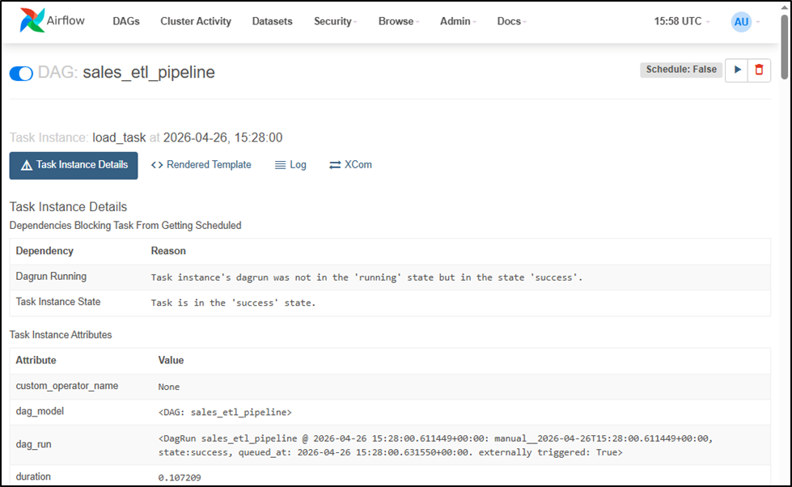
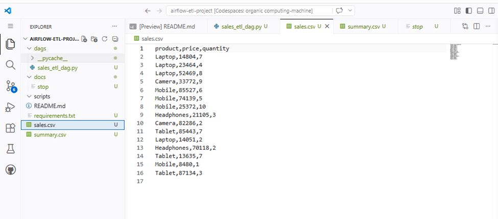
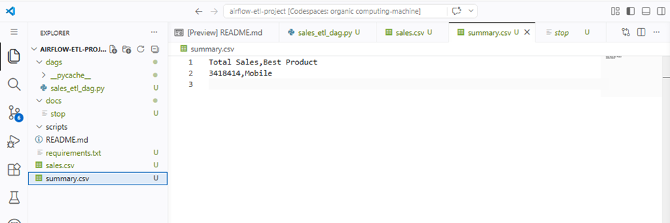

#  Workflow Automation using Apache Airflow

## 🔗 Project Overview
This project demonstrates how to automate a complete ETL (Extract, Transform, Load) workflow using Apache Airflow.  
The pipeline generates random sales data, processes it, and produces meaningful insights automatically using scheduled DAG execution.

---
## 🔗 Objectives
- Automate data workflow using Airflow DAG  
- Implement ETL pipeline using Python  
- Schedule and monitor tasks  
- Generate insights from raw data  

---
## 🛠️ Technologies Used
- Python  
- Apache Airflow  
- CSV (Data Storage)  

---

## 🔄 Workflow (ETL Pipeline)

### 1️⃣ Extract
- Reads sales data from `sales.csv`

### 2️⃣ Transform
- Calculates:
  - **Total Sales** → `price × quantity`
  - **Best Selling Product** (highest quantity sold)

### 3️⃣ Load
- Saves final results into `summary.csv`

---
## 📂 Project Structure

```bash
airflow-etl-project/
│
├── dags/
│   └── sales_etl_dag.py    # main DAG file
├── sales.csv               # generated data
├── summary.csv             # output file
├── requirements.txt        # dependencies
└── README.md
```

## ▶️ How to Run

## Step 1: Install Airflow
```bash
pip install apache-airflow
 ```

## Step 2: Start Airflow
```bash
airflow standalone
 ```
## Step 3: Open UI
Go to:
http://localhost:8080

## Step 4: Run DAG
Enable `sales_etl_pipeline`  
- Click ▶️ Trigger DAG  

## 📊 Sample Output
### sales.csv
```csv
product,price,quantity
Laptop,50000,2
Mobile,30000,3
```

### summary.csv
```csv
Total Sales,Best Product
190000,Mobile
```
## 📈 Key Features
Fully automated ETL pipeline
Random data generation
Task dependency management
Daily scheduling support
Clean and simple architecture
## 🔗 Screenshots












## 🔗 Learning Outcomes
- Understanding of workflow automation  
- Hands-on experience with Airflow DAGs  
- ETL pipeline design  
- Task scheduling and monitoring  

## 👩‍💻 Author
Amna Pervez

## 🔗 Conclusion

This project successfully demonstrates how Apache Airflow can be used to automate data pipelines efficiently. It provides a scalable foundation for real-world data engineering workflows.